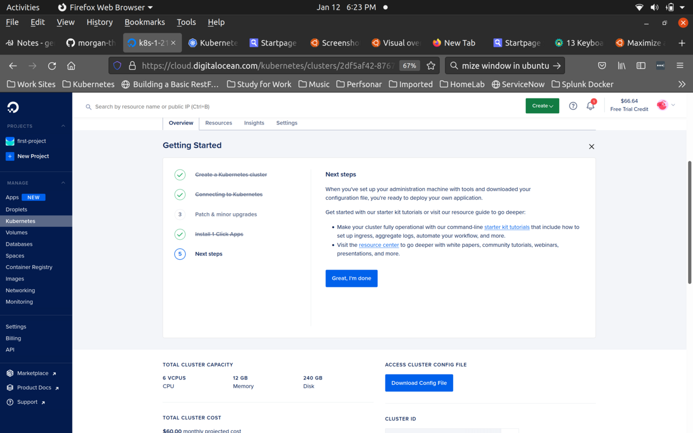

# Digital Ocean Kubernetes Challenge 
#
## Deploy a Scalable Message Queue 
#
### Morgan Thistle 
### thistle-morgan@gmail.com 
#
## This is a short how-to on setting up a RabbitMq Cluster on Digital Ocean Kubernetes cluster, with an autoscaling demo

### **Prerequisites**:

    Digital Ocean account

    A Kubernetes Cluster running on Digital Ocean

    kubectl setup locally

    kubeconfig filed downloaded 

    doctl setup locally 
        Follow these instructions: 
        https://docs.digitalocean.com/reference/doctl/how-to/install/


 ## Setting up a Kubernets Cluster on Digital Ocean 
### This is really easy with Digital Oceans GUI 
### Go to digitalocean.com and click on Kubernetes on the left.


### Select your Kubernetes version. Stick with the default if your new to Kubernetes

### Choose a datacenter region, closer to your physical location the better.

 
### Now, to choose the cluster capacity. 


### Make sure to check the Monthly Rate


### At the bottom, you can finalize. You can change the cluster's name, the project associated with it, or add tags. 

### And it's just that easy to setup a Kubernetes Cluster
#
### While the cluster is setting up, we need to get access to the cluster. Click on 'Get Started'


### Make sure that you get the kubeconfig file and setup the Digitial Ocean CTL cli tool doctl. Once done, click Continue


### Choose the date and time for automatically installation of minor patches, then click Save & Continue


### Next is Digital Ocean 'Marketplace 1-Click Apps', a great way to explore apps on Kubernetes, quickly setup and expand your cluster without a lot of setup. 


### The last screen is a chance to review the cluster and download the access cluster config file if needed. 

## Now that we are all set up, lets get started!


#
## **First**
### We need to setup the RabbitMQ Cluster. The easiest way is to install it is using an Operator. 

### This is a fairly good definition of what an operator is:

    "In Kubernetes, an operator is an application-specific controller that can help you package, deploy, and manage a Kubernetes application." 	

    https://www.aquasec.com/cloud-native-academy/kubernetes-101/kubernetes-operators/

### The Operator is already written and currently maintained so all we have to do is install it. 

    Install the RabbitMQ Cluster Operator:

        kubectl apply -f "https://github.com/rabbitmq/cluster-operator/releases/latest/download/cluster-operator.yml"

### Using this method means that we will accept some defaults, the main one being that the operator is installed in a new namespace, rabbitmq-system. ### There will be output that this operation was successful.
### However to check, you can run:

    kubectl get all -n rabbitmq-system* (shows most of what is installed in the new namespace)

    kubectl get pods -n rabbitmq-system* (shows the pod(s) installed and there state)

#
## **Second** 
### We need to setup the RabbitMQ Cluster. The previous step only installed the Operator.
#
   ### Included is a yaml file to deploy a simple one instance RabbitMQ Cluster. For production or more robust environments, multiple instances must be used, always in odd numbers (1,3,5,etc). The yaml file includes pod resource limits as well as setting the default username and password. The username and password are both set to guest. This is necessary to allow the demo programs access to the RabbitMQ. Of course, these settings will need to be changed for any environment other than a test environment.

    Setup the RabbitMQ Cluster run:

       kubectl apply -f deploy-rabbitmq-cluster.yaml

   	To check we can run:

        kubectl get pods -n demo

    We should see this output:

        NAME                       	    READY   STATUS    RESTARTS   AGE
        demo-rabbitmqcluster-server-0   1/1     Running   0          23h


### Now the RabbitMQ Cluster is setup. 


### Next, we will demonstrate how to autoscale an application based on the size of a queue in RabbitMQ.

### To do this, we will need 3 applications, a producer of messages, a worker to consume the messages, and an autoscaling app that will increase/decrease the worker deployment in response to the message queue. 
#
### **Worker App**

### The worker deployment will create only one pod. The worker app will be the application that gets autoscaled to handle more messages from the queue. The worker app will create a connection to the RabbitMQ Cluster, create a new message queue, then watch the queue for new messages. The RabbitMq Cluster name is set in the previous step. The worker app will pause for 3 seconds before processing the next message.This mimics time to process each message.

### To setup the worker:

    kubectl apply -f deploy-worker.yaml

### To check:

    kubectl get pods

### The app will also create logs, one for waiting for messages, a log for each message received and a log for when it has processed it (after the 3 second delay).

### The worker app was taken from the rabbitmq.com tutorial (https://rabbitmq.com/tutorials/tutorial-one-python.html).

### To check the logs, you will need to get the pod name from the previous command, then use:

    kubectl logs <worker-pod-name>


### **Autoscaler**

### The autoscaler was taken from this github repo: https://github.com/onfido/k8s-rabbit-pod-autoscaler

### Modifications to the env variables were made so it would work with this demo.

    env:

        - name: INTERVAL
          value: "15"
        - name: RABBIT\_HOST
          value: "demo-rabbitmqcluster.demo"
        - name: RABBIT\_USER
          value: "guest"
        - name: RABBIT\_PASS
          value: "guest"
        - name: AUTOSCALING
        value: >
          1|5|6|default|worker|demo_queue


### All the above can be modified in the deploy-autoscaler.yaml. The RABBIT\_HOST, RABBIT\_USER, RABBIT\_PASS settings will need to be changed in other apps if modified here. 

### For the 'value' it means:

    "min/max pods, messages handled per pod, deployment info and queue name in the following pattern:

      <minPods>|<maxPods>|<mesgPerPod>|<k8s namespace>|<k8s deployment name>|<RabbitMQ queue name>

### To setup the autoscaler:

    kubectl apply -f k8s-rabbit-pod-autoscaler/deploy-autoscaler.yml

### This will deploy one pod in the kube-system namespace. 

### To check, we can run these commands: 

    kubectl get pods -n kube-system

    kubectl -n kube-system logs rabbit-pod-autoscaler-<string

## The autoscaler app will log when it scales up or down the worker deployment. So logs will only happen when the app does something. 
#
#
### **DEMO**

### To observe the demo, we will need a total of 3 terminals. 

### Start two new terminals:

### in one terminal, run: 

   	kubectl -n kube-system logs -f rabbit-pod-autoscaler-<string>

### We will be able to observe the autoscaler adding and removing pods
#

### in another terminal, run:

    kubectl get pods --watch

### This will allow us to watch the creating, running and termination of the new worker pods. 

### The messages are generated and sent by a pod call producer. It will generate 30 messages like "This is message: 1 ...". The dots ‘.’ are what tells the worker app to pause. The more "." the longer the pause. 

### In the autscaler env settings we set 1|5|6, so the minimal pod is 1, the maximum in 5 and the maximum messages per pod is 6. So with 30 messages, it should scale to 5 worker pods and as the messages are processed, scale down to 4 pods, 3 pods, etc. This will be seen in the logs from the autoscaler pod. 

### To start the demo, start the producer pod to create messages:

    kubectl apply -f pod.yaml

### The autoscaler logs will look like:
````

    Thu Dec 30 14:56:00 UTC 2021 -- Scaled default: worker to 4 pods (28 msg in RabbitMQ)
    Thu Dec 30 14:56:15 UTC 2021 -- Scaled default: worker to 3 pods (18 msg in RabbitMQ)
    Thu Dec 30 14:56:31 UTC 2021 -- Scaled default: worker to 2 pods (0 msg in RabbitMQ)
    Thu Dec 30 14:56:46 UTC 2021 -- Scaled default: worker to 1 pods (0 msg in RabbitMQ)
````


### The kubectl get pods --watch output will look like:
````

    worker-5c9f7f8589-cns9h   1/1     Running   0          24h
    producer                  0/1     Pending   0          0s
    producer                  0/1     Pending   0          0s
    producer                  0/1     ContainerCreating   0          0s
    worker-5c9f7f8589-9pj9g   0/1     Pending             0          0s
    worker-5c9f7f8589-9pj9g   0/1     Pending             0          0s
    worker-5c9f7f8589-thnvc   0/1     Pending             0          0s
    worker-5c9f7f8589-kmt6s   0/1     Pending             0          0s
    worker-5c9f7f8589-9pj9g   0/1     ContainerCreating   0          0s
    worker-5c9f7f8589-thnvc   0/1     Pending             0          0s
    worker-5c9f7f8589-kmt6s   0/1     Pending             0          0s
    worker-5c9f7f8589-kmt6s   0/1     ContainerCreating   0          0s
    worker-5c9f7f8589-thnvc   0/1     ContainerCreating   0          0s
    worker-5c9f7f8589-kmt6s   1/1     Running             0          2s
    worker-5c9f7f8589-thnvc   1/1     Running             0          3s
    worker-5c9f7f8589-9pj9g   1/1     Running             0          3s
    worker-5c9f7f8589-9pj9g   1/1     Terminating         0          15s
    worker-5c9f7f8589-kmt6s   1/1     Terminating         0          31s
    worker-5c9f7f8589-thnvc   1/1     Terminating         0          46s
    worker-5c9f7f8589-9pj9g   0/1     Terminating         0          46s
    worker-5c9f7f8589-9pj9g   0/1     Terminating         0          47s
    worker-5c9f7f8589-9pj9g   0/1     Terminating         0          47s
    worker-5c9f7f8589-kmt6s   0/1     Terminating         0          61s
    worker-5c9f7f8589-kmt6s   0/1     Terminating         0          67s
    worker-5c9f7f8589-kmt6s   0/1     Terminating         0          67s
    worker-5c9f7f8589-thnvc   0/1     Terminating         0          77s
    worker-5c9f7f8589-thnvc   0/1     Terminating         0          78s
    worker-5c9f7f8589-thnvc   0/1     Terminating         0          78s
````
### There is another setting in the autoscaler, the "INTERVAL" setting. It is set to "15" which is the number of seconds it waits to view the messages in the queue. So in the above output, the first worker pod was able to process 2 messages before the autoscaler check. That is why only 4 worker pods were added. 
#
### **Conclusion**

### I would like to thank Digital Ocean for their Kubernetes Challange. This has given me and others an opportunity to explore kubernetes on Digital Ocean, to become acquainted with kubernetes as a platform and the ease of use of Digital Ocean. 
### I would also like to thank the RabbitMQ team for their tutorials, and other excellent documentation. 

### Also, I need to thank Onfido, without this persons work on autoscaler, I would not be able to have done this. Many thanks. 

### It is very easy to set up apps to run on kubernetes. But it does take extra effort to fully realize kubernetes offerings and potential.

### In this tutorial we covered one important part of that, autoscaling. The ease of scaling out as well as in is very important in today's application environments. This modest tutorial shows a very easy example of it.

### I hope this is of use. Thank you. 
